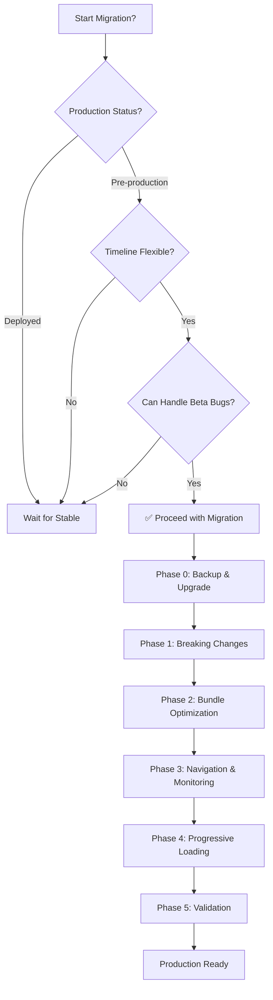
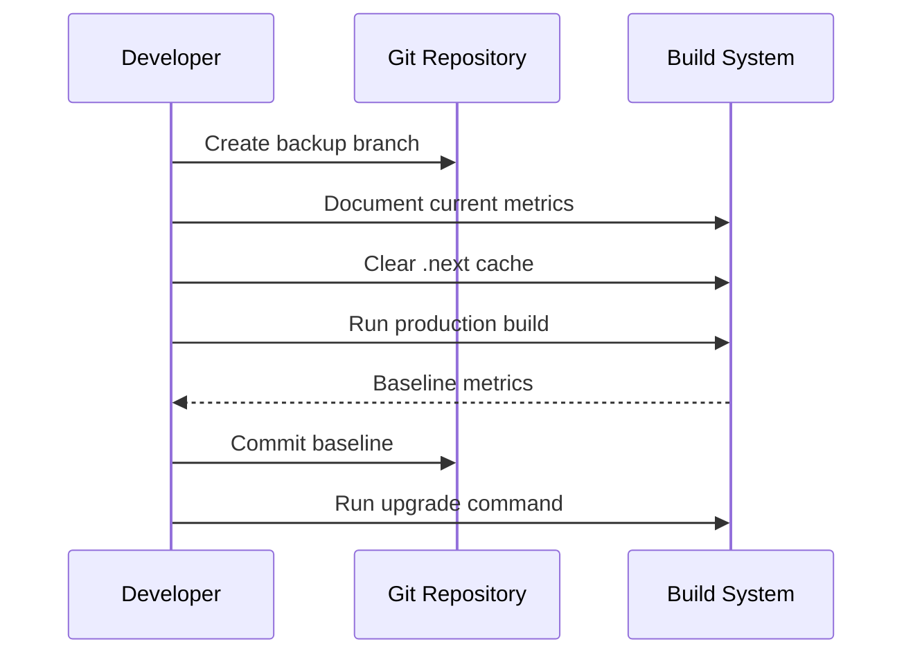
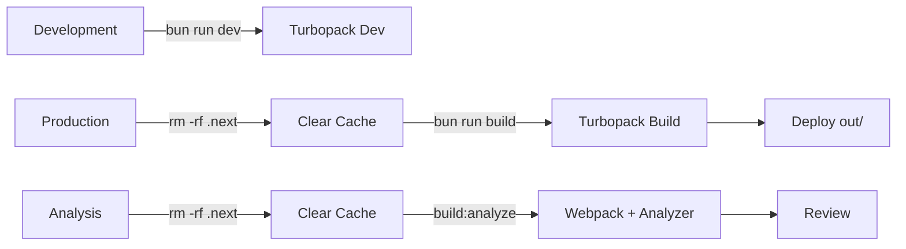
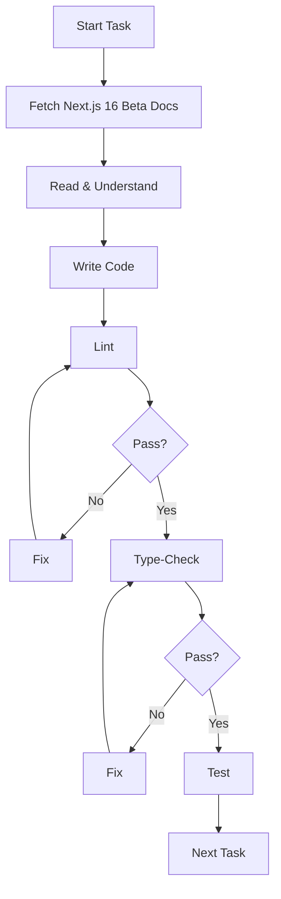
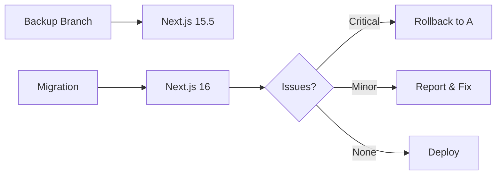

<!-- daf78d59-ce23-4dae-9bc9-2e7eb656cd9b 4dd9e3fe-a7a4-4294-a6a2-8b0bc7362b54 -->
# Metro Station Finder - Next.js 16 Beta Migration & Optimization Plan

## Overview

This plan migrates Metro Station Finder from Next.js 15.5 to Next.js 16 beta, leveraging Turbopack (stable), React Compiler (stable), enhanced routing, and new caching APIs. Includes runtime Web Vitals monitoring and comprehensive testing strategy.

**Next.js 16 Status**: Beta (Oct 9, 2025) → Stable (~Nov 2025)

## Migration Decision Tree



## Why Upgrade to Next.js 16 Beta?

### Perfect Timing

- ✅ Pre-production (not yet deployed)
- ✅ High beta adoption (50% dev, 20% prod builds)
- ✅ Stable release before production launch

### Performance Wins

- **Turbopack (stable)**: 2-5x faster builds (2.6s → <1s potential)
- **Filesystem caching**: Faster dev restarts
- **Enhanced routing**: Layout deduplication, incremental prefetching
- **React Compiler (stable)**: Automatic memoization

### New Features

- `updateTag()` - Read-your-writes for interactive features
- `refresh()` - Refresh uncached data only
- Layout deduplication - Download shared layouts once
- Incremental prefetching - Only fetch missing parts

## Current Baseline (Next.js 15.5 + Turbopack)

```text
Shared JS: 198 KB
Build Time: 2.6s
Homepage: 233 KB
Routes: All <210 KB first load
```

## Performance Targets

| Metric | Current | Target | Priority |

|--------|---------|--------|----------|

| Shared JS | 198 KB | <150 KB | High |

| Build Time | 2.6s | <1s | High |

| LCP | TBD | <1.5s | Critical |

| INP | TBD | <100ms | Critical |

| CLS | TBD | <0.05 | High |

| Nav Feedback | None | <50ms | Critical |

---

## Part 1: Migration Prerequisites

### 1.1 Upgrade Dependencies

**Commands**:

```bash
# Automated (recommended)
npx @next/codemod@canary upgrade beta

# Or manual
bun install next@beta react@latest react-dom@latest
bun install babel-plugin-react-compiler@latest
bun install web-vitals@latest
```

**Version Requirements**:

- Node.js 20.9+ (LTS)
- TypeScript 5.1+ (using 5.9.3 ✅)
- Next.js 16.0.0-beta
- React 19.2+

### 1.2 Backup Strategy



**Steps**:

1. Create branch: `git checkout -b next-16-migration`
2. Document current build output
3. Clear cache: `rm -rf .next`
4. Run: `bun run build`
5. Save metrics for comparison
6. Test all routes manually

---

## Part 2: Breaking Changes Migration

### 2.1 Async params and searchParams (CRITICAL)

**Files Affected**: `app/station-finder/page.tsx`, `app/fare-calculator/page.tsx`

**Before (Next.js 15.5)**:

```typescript
// ❌ Synchronous access
'use client';

import { useSearchParams } from 'next/navigation';

export default function StationFinderPage() {
  const searchParams = useSearchParams();
  const initialStationId = searchParams.get("station");
  
  return <StationFinderContent initialStationId={initialStationId} />;
}
```

**After (Next.js 16)**:

```typescript
// ✅ Server component with async params
export default async function StationFinderPage({
  searchParams,
}: {
  searchParams: Promise<{ [key: string]: string | string[] | undefined }>;
}) {
  const resolvedSearchParams = await searchParams;
  const initialStationId = typeof resolvedSearchParams.station === 'string' 
    ? resolvedSearchParams.station 
    : undefined;
  
  return <StationFinderContent initialStationId={initialStationId} />;
}
```

**Client Component**:

```typescript
// File: app/station-finder/_components/station-finder-content.tsx
'use client';

import { useState, useEffect } from 'react';
import type { Station } from '@/lib/types/station';

type StationFinderContentProps = {
  readonly initialStationId?: string;
};

export function StationFinderContent({ initialStationId }: StationFinderContentProps) {
  const [selectedStation, setSelectedStation] = useState<Station | undefined>();
  
  useEffect(() => {
    if (initialStationId) {
      // Fetch and set station
    }
  }, [initialStationId]);
  
  return (
    <main className="flex min-h-[calc(100vh-8rem)] flex-col">
      {/* Station finder UI */}
    </main>
  );
}
```

**Implementation Steps**:

1. Fetch Next.js 16 beta docs for `params`/`searchParams`
2. Make page component `async`
3. Add TypeScript types
4. Await `searchParams`
5. Extract values
6. Create client component
7. Pass primitive values as props
8. Run `bun run lint` → must pass
9. Run `bun run type-check` → must pass
10. Test with URL params

### 2.2 Async Server Functions

**Search Pattern**:

```bash
grep -r "cookies()" app/
grep -r "headers()" app/
grep -r "draftMode()" app/
```

**Change**:

```typescript
// ❌ Next.js 15.5
const cookieStore = cookies();

// ✅ Next.js 16
const cookieStore = await cookies();
```

**Steps**:

1. Search codebase
2. Add `await` before calls
3. Make parent functions `async`
4. Lint + type-check

### 2.3 Configuration Updates

**File**: `next.config.ts`

**Before**:

```typescript
experimental: {
  reactCompiler: true,  // ❌
}
```

**After**:

```typescript
const nextConfig: NextConfig = {
  reactCompiler: true,  // ✅ Stable, top-level
  
  turbopack: {
    rules: {
      '*.svg': {
        loaders: ['@svgr/webpack'],
        as: '*.js',
      },
    },
  },
  
  experimental: {
    turbopackFileSystemCacheForDev: true,
    cacheComponents: true,
    optimizePackageImports: [
      'lucide-react',
      'zod',
      'react-hook-form',
      '@hookform/resolvers',
      'motion',
      '@tsparticles/react',
      '@tsparticles/slim',
      '@vis.gl/react-google-maps',
    ],
  },
};
```

**Steps**:

1. Fetch Next.js 16 beta config docs
2. Move `reactCompiler` to top-level
3. Add `turbopackFileSystemCacheForDev: true`
4. Add `cacheComponents: true`
5. Remove deprecated flags
6. Lint + type-check + build

### 2.4 Image Configuration

**Next.js 16 Defaults** (only override if needed):

```typescript
images: {
  unoptimized: true,  // For static export
  // Defaults:
  // minimumCacheTTL: 14400 (4 hours)
  // imageSizes: [32, 48, 64, 96, 128, 256, 384]
  // qualities: [75]
  // dangerouslyAllowLocalIP: false
  // maximumRedirects: 3
}
```

---

## Part 3: Bundle Optimization

### 3.1 Import Optimization

**File**: `next.config.ts`

```typescript
modularizeImports: {
  'lucide-react': {
    transform: 'lucide-react/icons/{{member}}',
  },
},

experimental: {
  optimizePackageImports: [
    'lucide-react',
    'zod',
    'react-hook-form',
    '@hookform/resolvers',
    'motion',
    '@tsparticles/react',
    '@tsparticles/slim',
    '@vis.gl/react-google-maps',
  ],
}
```

**Remove Webpack Config** (if present):

```typescript
// ❌ DELETE - Turbopack ignores this
webpack: (config) => {
  config.optimization.splitChunks = {...};
  return config;
}
```

**Convert Imports**:

```typescript
// ❌ Wrong
import * as Icons from 'lucide-react';

// ✅ Correct
import { Home, MapPin, Calculator } from 'lucide-react';
```

### 3.2 Font Optimization

**File**: `app/layout.tsx`

```typescript
import { Ropa_Sans, Geist_Mono } from 'next/font/google';

const ropaSans = Ropa_Sans({
  weight: '400',
  subsets: ['latin'],
  display: 'swap',
  preload: true,
  variable: '--font-ropa-sans',
});

const geistMono = Geist_Mono({
  subsets: ['latin'],
  display: 'swap',
  preload: false,
  variable: '--font-geist-mono',
});

export default function RootLayout({ children }) {
  return (
    <html lang="en" className={`${ropaSans.variable} ${geistMono.variable}`}>
      <head>
        {/* DO NOT add manual font links */}
      </head>
      <body className={ropaSans.className}>
        {children}
      </body>
    </html>
  );
}
```

**Remove**:

- All manual `<link>` tags for fonts
- All `<link rel="preconnect">` for fonts
- All `<link rel="dns-prefetch">` for fonts

### 3.3 Progressive Loading

**Lazy Load Sparkles** (`components/hero/hero-section.tsx`):

```typescript
'use client';

import { lazy, Suspense, useState, useEffect, useRef } from 'react';

const Sparkles = lazy(() => 
  import('@/components/ui/sparkles').then(mod => ({ default: mod.Sparkles }))
);

export function Hero() {
  const [shouldLoadSparkles, setShouldLoadSparkles] = useState(false);
  const heroRef = useRef<HTMLElement>(null);

  useEffect(() => {
    const element = heroRef.current;
    if (!element) return;

    const observer = new IntersectionObserver(
      (entries) => {
        if (entries[0]?.isIntersecting) {
          setTimeout(() => setShouldLoadSparkles(true), 1000);
          observer.disconnect();
        }
      },
      { threshold: 0.1 }
    );

    observer.observe(element);
    return () => observer.disconnect();
  }, []);

  return (
    <section ref={heroRef} className="relative...">
      {shouldLoadSparkles && (
        <Suspense fallback={null}>
          <div className="pointer-events-none absolute inset-0" aria-hidden="true">
            <Sparkles />
          </div>
        </Suspense>
      )}
      <div className="relative z-10">{/* Hero content */}</div>
    </section>
  );
}
```

**Optimize Sparkles** (`components/ui/sparkles.tsx`):

```typescript
'use client';

import { memo, useMemo, useEffect, useState } from 'react';
import { useTheme } from 'next-themes';
import Particles, { initParticlesEngine } from '@tsparticles/react';
import { loadSlim } from '@tsparticles/slim';

// Singleton pattern
let engineInitialized = false;
let enginePromise: Promise<void> | null = null;

const initEngine = async (): Promise<void> => {
  if (engineInitialized) return;
  if (enginePromise) return enginePromise;
  
  enginePromise = initParticlesEngine(async (engine) => {
    await loadSlim(engine);
  }).then(() => {
    engineInitialized = true;
  });
  
  return enginePromise;
};

export const SparklesCore = memo(function SparklesCore(props) {
  const { resolvedTheme } = useTheme();
  
  const particleColorState = useMemo(() => {
    return resolvedTheme === 'dark' ? '#10b981' : '#047857';
  }, [resolvedTheme]);
  
  // Memoize configuration
  const particlesOptions = useMemo(() => ({
    // ... config
  }), [particleColorState]);
  
  return (
    <div style={{
      willChange: 'opacity, transform',
      contain: 'layout style paint',
      transform: 'translateZ(0)',
    }}>
      <Particles options={particlesOptions} />
    </div>
  );
});
```

---

## Part 4: Navigation Feedback

### 4.1 Global Loading Indicator

**File**: `components/navigation/nav-loading-indicator.tsx` (NEW)

```typescript
'use client';

import { useLinkStatus } from 'next/link';
import { motion } from 'motion/react';
import { useEffect, useState } from 'react';

export function NavLoadingIndicator() {
  const { pending } = useLinkStatus();
  const [progress, setProgress] = useState(0);

  useEffect(() => {
    if (pending) {
      setProgress(0);
      const interval = setInterval(() => {
        setProgress(prev => Math.min(prev + 10, 90));
      }, 100);
      return () => clearInterval(interval);
    }
    
    setProgress(100);
    const timer = setTimeout(() => setProgress(0), 300);
    return () => clearTimeout(timer);
  }, [pending]);

  if (progress === 0) return null;

  return (
    <motion.div
      className="fixed top-0 left-0 right-0 z-[100] h-1 bg-gradient-to-r from-primary via-primary/80 to-primary/60"
      style={{ scaleX: progress / 100, transformOrigin: 'left' }}
      animate={{ scaleX: progress / 100 }}
      transition={{ duration: 0.2 }}
      role="progressbar"
      aria-valuenow={progress}
    />
  );
}
```

### 4.2 Per-Link States

**File**: `components/navigation/nav-bar.tsx`

```typescript
const NavLink = memo(function NavLink({ href, label, icon: Icon, isActive }) {
  const { pending } = useLinkStatus();
  
  return (
    <Link
      href={href}
      className={cn(
        "group relative flex items-center gap-2",
        pending && "opacity-60 cursor-wait"
      )}
    >
      <Icon className={cn(pending && "animate-pulse")} />
      <span>{label}</span>
      {pending && (
        <span className="absolute -top-1 -right-1 flex h-3 w-3">
          <span className="animate-ping absolute inline-flex h-full w-full rounded-full bg-primary opacity-75" />
        </span>
      )}
    </Link>
  );
});
```

---

## Part 5: Real-User Monitoring

### 5.1 Web Vitals Setup

**File**: `lib/metrics/web-vitals.ts` (NEW)

```typescript
export function onPerfEntry(entry: any) {
  if (!entry) return;
  console.info('[Web Vitals]', entry.name, Math.round(entry.value), 'ms');
  
  // TODO: Send to analytics
  // fetch('/api/metrics', { method: 'POST', body: JSON.stringify(entry) });
}
```

**File**: `components/metrics/web-vitals-monitor.tsx` (NEW)

```typescript
'use client';

import { useEffect } from 'react';
import { onCLS, onINP, onLCP, onFCP, onTTFB } from 'web-vitals';
import { onPerfEntry } from '@/lib/metrics/web-vitals';

export function WebVitalsMonitor() {
  useEffect(() => {
    onCLS(onPerfEntry);
    onINP(onPerfEntry);
    onLCP(onPerfEntry);
    onFCP(onPerfEntry);
    onTTFB(onPerfEntry);
  }, []);
  
  return null;
}
```

**Integration**: Add to `app/layout.tsx`

```typescript
import { WebVitalsMonitor } from '@/components/metrics/web-vitals-monitor';

export default function RootLayout({ children }) {
  return (
    <html>
      <body>
        <Providers>
          <NavLoadingIndicator />
          <NavBar />
          {children}
          <Footer />
          <WebVitalsMonitor />
        </Providers>
      </body>
    </html>
  );
}
```

---

## Part 6: Build & Deployment

### 6.1 Build Scripts

**File**: `package.json`

```json
{
  "scripts": {
    "dev": "next dev",
    "build": "next build",
    "build:analyze": "cross-env ANALYZE=true next build",
    "lint": "bunx ultracite@latest check",
    "format": "bunx ultracite@latest fix",
    "type-check": "tsc --noEmit"
  }
}
```

### 6.2 Build Workflow



**Commands**:

```bash
# Development
bun run dev

# Production
rm -rf .next
bun run build

# Analysis (occasional)
rm -rf .next
bun run build:analyze
```

**Rule**: Always `rm -rf .next` when switching builders

---

## Implementation Roadmap

```mermaid
gantt
    title Migration Timeline
    dateFormat HH:mm
    axisFormat %H:%M
    
    section Phase 0
    Backup & Upgrade :p0, 00:00, 30m
    
    section Phase 1
    Async params :p1a, after p0, 1h
    Server Functions :p1b, after p1a, 30m
    Config Updates :p1c, after p1b, 1h
    
    section Phase 2
    Import Optimization :p2a, after p1c, 1h
    Font Migration :p2b, after p2a, 1h
    Wildcard Conversion :p2c, after p2b, 1h
    
    section Phase 3
    Global Indicator :p3a, after p2c, 1h
    Per-Link States :p3b, after p3a, 30m
    Web Vitals :p3c, after p3b, 30m
    
    section Phase 4
    Lazy Sparkles :p4a, after p3c, 1h
    Optimize Internals :p4b, after p4a, 1h
    
    section Phase 5
    Validation :p5, after p4b, 1h
```



### Phase 0: Backup (30 min)

- [ ] Create branch
- [ ] Document metrics
- [ ] Clear cache
- [ ] Run baseline build
- [ ] Run upgrade command
- [ ] Install web-vitals

### Phase 1: Breaking Changes (2-3 hours)

- [ ] **Task 1.1**: Async params/searchParams
  - [ ] Fetch Next.js 16 beta docs
  - [ ] Update station-finder page
  - [ ] Update fare-calculator page
  - [ ] Create client components
  - [ ] Test with URL params
- [ ] **Task 1.2**: Server functions
  - [ ] Search for cookies/headers/draftMode
  - [ ] Add await
  - [ ] Make functions async
- [ ] **Task 1.3**: Configuration
  - [ ] Move reactCompiler to top-level
  - [ ] Add turbopack config
  - [ ] Remove webpack config

### Phase 2: Bundle Optimization (2-3 hours)

- [ ] Add modularizeImports
- [ ] Migrate to next/font
- [ ] Convert wildcard imports
- [ ] Build and verify reduction

### Phase 3: Navigation & Monitoring (2 hours)

- [ ] Create nav-loading-indicator
- [ ] Update nav-bar with per-link states
- [ ] Setup Web Vitals monitoring

### Phase 4: Progressive Loading (2 hours)

- [ ] Lazy load Sparkles
- [ ] Optimize Sparkles internals
- [ ] Test rendering

### Phase 5: Validation (1 hour)

- [ ] Build and compare metrics
- [ ] Run Lighthouse
- [ ] Test all routes
- [ ] Document results

---

## Success Metrics

| Metric | Next.js 15.5 | Target | Improvement |

|--------|--------------|--------|-------------|

| Shared JS | 198 KB | <150 KB | -48 KB (24%) |

| Build Time | 2.6s | <1s | 2.6x faster |

| Homepage | 233 KB | <200 KB | -33 KB (14%) |

### Core Web Vitals

| Metric | Target | Lab | RUM |

|--------|--------|-----|-----|

| LCP | <1.5s | ✅ | 🔄 |

| INP | <100ms | ✅ | 🔄 |

| CLS | <0.05 | ✅ | 🔄 |

---

## Code Quality Standards

### Implementation Workflow

**⚠️ Next.js 16 Beta Documentation Requirement**



**Per-File Steps**:

1. Fetch Next.js 16 beta docs (Context7)
2. Read and understand
3. Write code based on docs
4. Run `bun run lint`
5. Run `bun run type-check`
6. Test functionality
7. Commit

**Documentation Source**: `https://nextjs.org/docs/beta`

### Requirements

- ✅ Zero TypeScript errors
- ✅ Zero linting errors
- ✅ No suppressions
- ✅ Always fetch beta docs before coding

---

## Guardrails Checklist

### Build

- [ ] Turbopack for production
- [ ] Clear `.next` when switching builders
- [ ] Analyzer occasional only

### Code

- [ ] No webpack splitChunks config
- [ ] Fonts only via next/font
- [ ] All server functions awaited
- [ ] All pages use async params
- [ ] No wildcard imports

### Configuration

- [ ] reactCompiler at top-level
- [ ] turbopackFileSystemCacheForDev enabled
- [ ] modularizeImports configured
- [ ] No deprecated flags

### Monitoring

- [ ] Web Vitals RUM active
- [ ] Lighthouse on all routes
- [ ] Beta bugs reported

---

## Beta Considerations



**Status**:

- Released: Oct 9, 2025
- Stable: ~Nov 2025 (1 month)
- Adoption: 50% dev, 20% prod

**Safe Because**:

- ✅ Pre-production
- ✅ Flexible timeline
- ✅ High adoption
- ✅ Major features stable

---

## Technical Stack

### Core

- Next.js 16.0.0-beta
- React 19.2+
- TypeScript 5.9.3
- Tailwind CSS 4.1.14
- Motion 12.23.24

### Build

- Turbopack (stable)
- Bun
- Ultracite

### Monitoring

- web-vitals
- Lighthouse CI

---

*Complete Next.js 16 beta migration with Turbopack, React Compiler, real-user monitoring, and production-ready guardrails.*

### To-dos

- [ ] **Create Branch**: Create new branch `next-16-metro-station` from `001-metro-station-finder`
- [ ] **Phase 0**: Upgrade dependencies - Document baseline metrics, upgrade to Next.js 16 beta, install web-vitals
- [ ] **Phase 1.1**: Async params/searchParams - Migrate station-finder and fare-calculator pages to async pattern with client components
- [ ] **Phase 1.2**: Server functions & config - Update cookies/headers calls, move reactCompiler to top-level, add Turbopack config
- [ ] **Phase 2**: Bundle optimization - Migrate to next/font, add modularizeImports, convert wildcard imports to named imports
- [ ] **Phase 3**: Navigation & monitoring - Create nav loading indicator, add per-link states, setup Web Vitals RUM
- [ ] **Phase 4**: Progressive loading - Lazy load Sparkles component with IntersectionObserver, optimize internals with memo
- [ ] **Phase 5**: Validation - Build and compare metrics, run Lighthouse on all routes, verify performance targets
- [ ] **Final**: Documentation - Update README with guardrails, document migration learnings, prepare for stable release